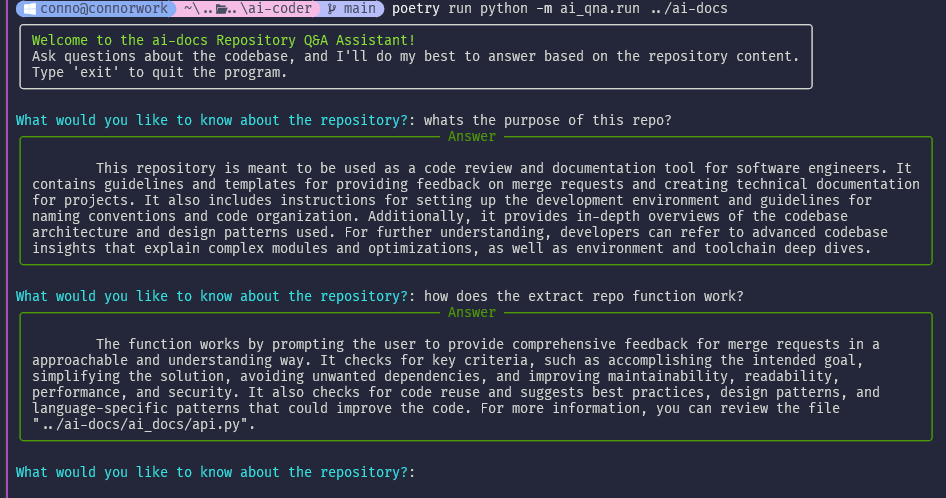

# Introduction



This code repository contains a Python-based AI-assisted Q&A system for analyzing and answering questions about a given code repository. The system utilizes the Langchain library for text processing and retrieval, OpenAI's language model for generating answers, and the Chroma vector store for efficient text retrieval.

The primary purpose of this project is to provide developers with an interactive tool to explore and understand a codebase by asking questions about its content, structure, and functionality. The AI assistant is designed to provide concise, technically accurate answers based on the information available in the repository.

# Codebase Overview

The codebase consists of three main Python files:

1. `extract_repo.py`: This module is responsible for extracting relevant code files from a local directory and converting them into a single text file for further processing.
2. `qna.py`: This module defines the `AskBot` class, which handles the question-answering process using the Langchain library and OpenAI's language model.
3. `run.py`: This module serves as the main entry point for the application, orchestrating the repository extraction, AI assistant initialization, and user interaction.

The project utilizes the Poetry dependency management tool to handle its dependencies, which are specified in the `pyproject.toml` file.

# Development Environment Setup

To set up the development environment, follow these steps:

1. Install Python 3.9 or later.
2. Install Poetry by following the instructions at https://python-poetry.org/docs/#installation.
3. Clone the repository and navigate to the project directory.
4. Run `poetry install` to install the required dependencies.
5. Create a `.env` file in the project root and add your OpenAI API key as `OPENAI_API_KEY=your_api_key_here`.

# Code Repository Structure

The repository has the following structure:

```
ai-qna/
├── ai_qna/
│   ├── __init__.py
│   ├── extract_repo.py
│   ├── qna.py
│   └── run.py
├── .gitignore
├── poetry.lock
├── pyproject.toml
└── README.md
```

- The `ai_qna` directory contains the main Python modules for the project.
- The `pyproject.toml` file specifies the project dependencies and build system.
- The `poetry.lock` file is generated by Poetry and contains the exact versions of the installed dependencies.
- The `.gitignore` file specifies files and directories that should be ignored by Git.
- The `README.md` file provides an overview of the project.

# Key Points of Complexity

1. Text extraction and preprocessing:
   - The `extract_repo.py` module handles the extraction of relevant code files from a local directory, skipping unnecessary files and directories.
   - It applies various filters to determine if a file is likely to be useful based on its path, name, and content.
   - The extracted files are combined into a single text file for further processing.

2. AI-assisted question answering:
   - The `qna.py` module defines the `AskBot` class, which utilizes the Langchain library and OpenAI's language model to generate answers based on the provided code repository.
   - It uses the Chroma vector store to efficiently retrieve relevant text chunks based on the input question.
   - The `RetrievalQA` chain from Langchain is used to combine the retrieved text chunks and generate a coherent answer.

3. User interaction and error handling:
   - The `run.py` module provides an interactive command-line interface for users to ask questions about the code repository.
   - It handles user input validation, displays progress indicators, and formats the output for better readability.
   - The module also handles common error scenarios, such as missing command-line arguments or invalid repository paths.

# Installation and Setup

To install and set up the project, follow these steps:

1. Ensure that you have Python 3.9 or later installed on your system.
2. Clone the repository to your local machine using `git clone https://github.com/yourusername/ai-qna.git`.
3. Navigate to the project directory: `cd ai-qna`.
4. Install the required dependencies using Poetry: `poetry install`.
5. Create a `.env` file in the project root and add your OpenAI API key as `OPENAI_API_KEY=your_api_key_here`.

# Getting Started

To start using the AI-assisted Q&A system, follow these steps:

1. Prepare the code repository you want to analyze by ensuring it is available on your local machine.
2. Open a terminal and navigate to the project directory.
3. Run the following command, replacing `<local repository directory>` with the path to your code repository:
   ```
   python ai_qna/run.py <local repository directory>
   ```
4. The AI assistant will process the repository and prepare the Q&A environment. Once ready, it will display a welcome message and prompt you to ask a question.
5. Type your question about the code repository and press Enter. The AI assistant will analyze the repository and generate an answer based on the available information.
6. Continue asking questions until you have the information you need. To exit the program, type "exit" and press Enter.

Remember that the AI assistant's knowledge is limited to the content of the provided code repository. If the information you're looking for is not available in the repository, the assistant will let you know.